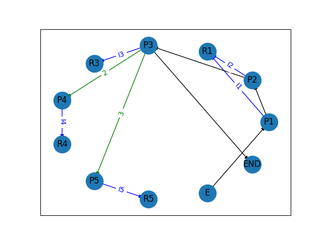

# QuizBot

El projecte QuizBot per GEI-LP (edició tardor 2019).

L'objectiu general de la pràctica consisteix en desenvolupar un chatbot que
permeti recollir les dades d’enquestes definides mitjançant un compilador a través de
_telegram_ i consultar gràfiques simples i informes sobre les dades recollides.

## Compilador

Cal fer un compilador per interpretar un llenguatge _Enquestes_ de definició
d’enquestes. El llenguatge permet definir preguntes i respostes. Una enquesta
és un conjunt de preguntes i respostes estructurades en seqüència o alternativa.
El següent exemple mostra el llenguatge:

```
P1: PREGUNTA                         // Pregunta amb identificador P1
Quants adults viuen a casa teva?
P2: PREGUNTA                         // Altra pregunta
Quants menors vien a casa teva?
R1: RESPOSTA                         // Resposta amb identificador R1
0: zero ;                            // Primera opció de resposta
1: un ;
2: dos ;
3: més de dos ;
I1: ITEM                             // Item: enllaça una pregunta amb
P1 -> R1                             // la seva resposta
I2: ITEM
P2 -> R1
P3: PREGUNTA
Com vas a la feina majoritàriament?
R3: RESPOSTA
1: caminant ;
2: en cotxe ;
3: en transport públic ;
I3: ITEM
P3 -> R3
P4: PREGUNTA
Utilitzes car sharing?
R4: RESPOSTA
1: Sı́ ;
2: No ;
I4: ITEM
P4 -> R4
P5: PREGUNTA
Quin mitja de transport utilitzes majoritàriament?
R5: RESPOSTA
1: Tren ;
2: Bus ;
3: Metro ;
4: Altres
I5: ITEM
P5 -> R5
A1: ALTERNATIVA                      // La resposta a I3 pot implicar una
I3 [(2,I4),(3,I5)]                   // altra pregunta
E: ENQUESTA                          // La llista de preguntes de l’enquesta
I1 I2 I3
END
```

### Gramàtica

Definiu la part lèxica (tokens) i sintàctica (gramàtica). Feu la gramàtica per a
que ANTLR4 pugui reconèixer-la. La regla inicial de la gramàtica és:
```
grammar Enquestes;
```

### AST a graf

Feu un script python3 que:
1. recorri l'AST mitjançant un _visitor_,
2. guardi l'estructura en un graf i,
3. generi una imatge amb la representació del graf.

A continuació teniu un exemple de com quedaria l'exemple anterior utilitzant la llibreria _networkx_:

<center></center>
