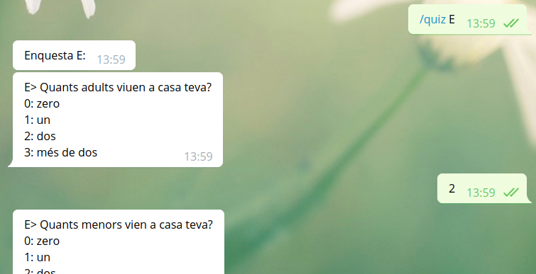
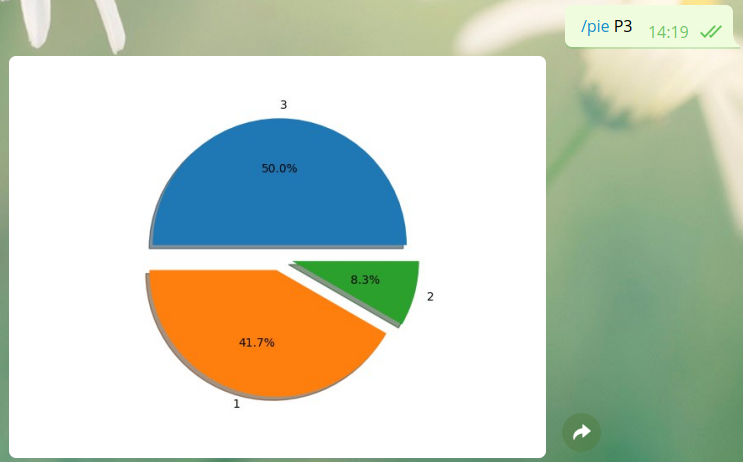
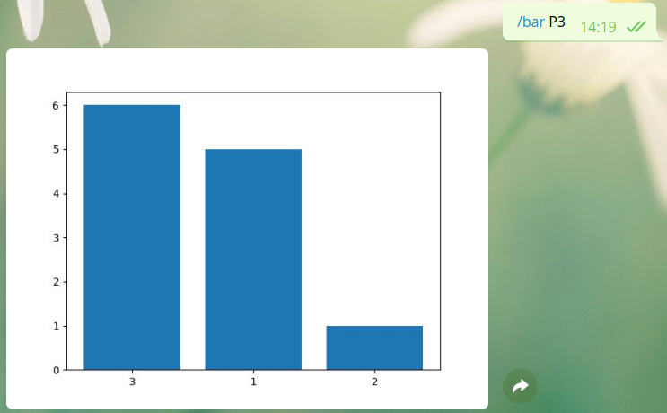
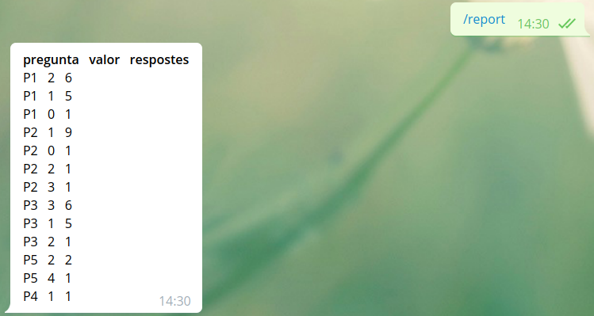

# QuizBot

El projecte QuizBot per GEI-LP (edició tardor 2019).

L'objectiu general de la pràctica consisteix en desenvolupar un chatbot que
permeti recollir les dades d’enquestes definides mitjançant un compilador a través de
_telegram_ i consultar gràfiques simples i informes sobre les dades recollides.

## Compilador

Cal fer un compilador per interpretar un llenguatge _Enquestes_ de definició
d’enquestes. El llenguatge permet definir preguntes i respostes. Una enquesta
és un conjunt de preguntes i respostes estructurades en seqüència o alternativa.
El següent exemple mostra el llenguatge:

```
P1: PREGUNTA                         // Pregunta amb identificador P1
Quants adults viuen a casa teva?
P2: PREGUNTA                         // Altra pregunta
Quants menors vien a casa teva?
R1: RESPOSTA                         // Resposta amb identificador R1
0: zero ;                            // Primera opció de resposta
1: un ;
2: dos ;
3: més de dos ;
I1: ITEM                             // Item: enllaça una pregunta amb
P1 -> R1                             // la seva resposta
I2: ITEM
P2 -> R1
P3: PREGUNTA
Com vas a la feina majoritàriament?
R3: RESPOSTA
1: caminant ;
2: en cotxe ;
3: en transport públic ;
I3: ITEM
P3 -> R3
P4: PREGUNTA
Utilitzes car sharing?
R4: RESPOSTA
1: Sı́ ;
2: No ;
I4: ITEM
P4 -> R4
P5: PREGUNTA
Quin mitja de transport utilitzes majoritàriament?
R5: RESPOSTA
1: Tren ;
2: Bus ;
3: Metro ;
4: Altres
I5: ITEM
P5 -> R5
A1: ALTERNATIVA                      // La resposta a I3 pot implicar una
I3 [(2,I4),(3,I5)]                   // altra pregunta
E: ENQUESTA                          // La llista de preguntes de l’enquesta
I1 I2 I3
END
```

### Gramàtica

Definiu la part lèxica (tokens) i sintàctica (gramàtica). Feu la gramàtica per a
que ANTLR4 pugui reconèixer-la. La regla inicial de la gramàtica és:
```
grammar Enquestes;
...
```

### AST a graf

Feu un script python3 que:
1. recorri l'AST mitjançant un _visitor_,
2. guardi l'estructura en un graf,
3. guardi el graf en un arxiu tipus _pickle_, i
4. generi una imatge amb la representació del graf.

A continuació teniu un exemple de com quedaria l'exemple anterior utilitzant la llibreria _networkx_:

<center></center>

A la gràfica les arestes negres corresponen a la seqüència de preguntes de l'enquesta, les verdes a les alternatives i les blaves als items.

## Telegram

La vostra tasca consisteix en implementar un Bot de Telegram que constesti
textualment i gràficament a preguntes relacionades amb les enquestes descrites
a la secció anterior, així com recullir les dades d'enquestes.

### Comandes del bot

El vostre Bot ha d’entendre i contestar correctament les comandes següents:
- `/start` inicia la conversa amb el Bot.
- `/help` el Bot ha de contestar amb una llista de totes les possibles comandes i
una breu documentació sobre el seu propòsit i ús.
- `/author` el Bot ha d’escriure el nom complet de l’autor del projecte i seu correu
electrònic oficial de la facultat.
- `/quiz <idEnquesta>` el Bot ha de iniciar un intèrpret similar al de la secció anterior realitzant
l’enquesta. A la secció següent s'amplia la informació.
- `/bar <idPregunta>` el Bot ha de tornar una gràfica de barres mostrant un diagrama de barres
de les respostes a la pregunta donada. A les seccions següents s'amplia la informació.
- `/pie <idPregunta>` el Bot ha de tornar una gràfica de formatget amb el percentatge de les respostes a la pregunta
donada. A les seccions següents s'amplia la informació.
- `/report` el Bot ha de tornar quelcom tipus taula amb el nombre de respostes obtingudes per cada valor de cada pregunta. A les seccions següents s'amplia la informació.

### Intèrpret 

Feu un intèrpret que interactui amb l'usuari, a partir de les dades de graf, en ser activada la comanda `quiz`. A continuació teniu un exemple d'interacció:
```
E> Quants adults viuen a casa teva?
0: zero
1: un
2: dos
3: més de dos
>> 2
E> Quants menors vien a casa teva?
0: zero
1: un
2: dos
3: més de dos
>> 1
E> Com vas a la feina majoritàriament?
1: caminant
2: en cotxe
3: en transport públic
>> 3
E> Quin mitja de transport utilitzes majoritàriament?
1: Tren
2: Bus
3: Metro
4: Altres
>> 4
E> Gràcies pel teu temps!
```
A telegram tindria el format següent:

<center></center>

Les respostes s’han de guardar en una estructura python3 que heu de dis-
senyar vosaltres. Utilitzeu el `pickle` de python per a que aquesta estructura estigui sempre
actualitzada en les múltiples execucions del bot.

### Gràfiques

Si tenim per a la pregunta _P3_ les dades:

*valor* | *contats*
--- | ---
1 | 5
2 | 1
3 | 6

La comanda `/pie P3` ens donarà quelcom com:

<center></center>

Fixeu-vos en que cada porció del formatget conté percentatges.

La comanda `/bar P3` ens donarà quelcom com:

<center></center>

Fixeu-vos en que cada barra conté el nombre d'enquestes que l'han votat.

### Report

La comanda `/report` ens ha de mostrar el nombre d'enquestes que han votat a cada valor de cada producte. A continuació teniu un exemple de com es veuria a _telegram_:

<center></center>

## Llibreries

Utilitzeu les llibreries de Python següents:

- `matplotlib` per graficar dades.
- `networkx` per a manipular grafs.
- `pickle` per guardar i carregar estructures de dades en binari.
- `python-telegram-bot` per interactuar amb Telegram.

Podeu utilitzar lliurament altres llibreries estàndards de Python, però si no són estàndards, heu de demanar permís als vostres professors (que segurament no us el donaran).

## Referències

- Matplotlib. The Matplotlib development team. 2018.
https://matplotlib.org/
- NetworkX. NetworkX Developers. 2019.
https://networkx.github.io/documentation/stable/
- pickle — Python object serialization. Python Software Foundation. 2019.
https://docs.python.org/3.6/library/pickle.html
- Bots de Telegram. Jordi Petit. 2019.
https://lliçons.jutge.org/python/telegram.html

## Lliurament

Heu de lliurar la vostra pràctica al Racó. Només heu de lliurar un fitxer ZIP
que, al descomprimir-se generi uns fitxers *.py, un fitxer requirements.txt i un
fitxer README.md. Res més. Sense directoris. — pendent —
Els vostres fitxers de codi en Python han de seguir les regles d’estı́l PEP8,
tot i que podeu oblidar les restriccions sobre la llargada màxima de les lı́nies.
Podeu utilitzar el paquet pep8 o http://pep8online.com/ per assegurar-vos
que seguiu aquestes regles d’estı́l. L’ús de tabuladors en el codi queda prohibit
(zero directe).

El projecte ha de contenir un fitxer README.md que el documenti. Vegeu,
per exemple, https://gist.github.com/PurpleBooth/109311bb0361f32d87a2.

El projecte també ha de contenir un fitxer requirements.txt amb les llibreries
que utilitza el vostre projecte. Vegeu, per exemple, https://pip.pypa.io/en/stable/user_guide/#requirements-files.

El termini de lliurament és el dijous 9 de gener a les 23:59.
